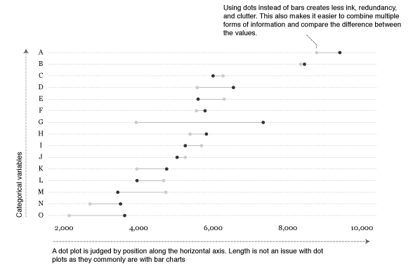

Readers make a number of judgments when reading graphs: they may judge the length of a
line, the area of a wedge of a circle, the position of a point along a common scale, the slope of a line, or a number of other attributes of the points, lines, and bars that are plotted.
[Cleveland and McGill (1984)](https://www.jstor.org/stable/2288400?seq=1#page_scan_tab_contents) identified tasks or judgments that are performed when reading
graphs and conducted carefully designed experiments to determine which of these judgments
we make most accurately. They then designed a graph to take advantage of the knowledge
gained from their experimentation. The result was the *dot plot*. 





This tutorial introduces the dot plot and compares them to bar charts for graphical presentations. I also show how to go from a basic Cleveland dot plot to a more refined, publication worthy graphic. If you're short on time jump to the sections of interest:

- [Replication requirements](#replication)
- [Basic dot plot](#basics)
- [Comparing multiple points of information](#groups)
- [Adding value markers](#markers)
- [Finishing touches](#finishing)

<br>

## Replication Requirements {#replication}
To reproduce the code throughout this tutorial you will need to load the following packages. The primary package of interest is [`ggplot2`](http://ggplot2.org/), which is a plotting system for R. You can build dot plots with base R graphics, but when I'm building more refined graphics I lean towards `ggplot2`. Note that I use the development version of ggplot2 which offers some nice title, subtitle, and caption options which I cover in the [last section](#finishing).  You can download the development version with this line of code: `devtools::install_github("hadley/ggplot2")`

```{r, echo=TRUE, message=FALSE, warning=FALSE, collapse=TRUE}
library(readxl)         # for reading in Excel data
library(dplyr)          # for data manipulation
library(tidyr)          # for data shaping
library(ggplot2)        # for generating the visualizations
```

```{r, echo=FALSE, message=FALSE, warning=FALSE, collapse=TRUE}
library(gridExtra)
```

In addition, throughout the tutorial I illustrate the graphics with this artificial [supermarket transaction data](https://www.dropbox.com/s/aoub0lfvo2s1zen/Supermarket%20Transactions.xlsx?dl=0).

```{r, echo=TRUE, message=FALSE, warning=FALSE, collapse=TRUE}
supermarket <- read_excel("~/Dropbox/Academia/University of Cincinnati/Intro to R Bootcamp/data/Supermarket Transactions.xlsx", sheet = "Data")

head(supermarket)
```


<a href="#top">Go to top</a>

<br>

## Basic Dot Plot {#basics}
Most readers would have little problem understanding either of the basic versions of the dot plot or the bar chart. Consider if we want to view total revenues by city in are supermarket data.  After a little data manipulation (*note that I order the cities by revenue and then make the `City` variable a factor with the levels ordered accordingly; this will allow us to order the bars and dots in the following charts appropriately*)...

```{r, echo=TRUE, message=FALSE, warning=FALSE, collapse=TRUE}
city_rev <- supermarket %>%
        group_by(City) %>%
        summarise(Revenue = sum(Revenue, na.rm = TRUE)) %>%
        arrange(Revenue) %>%
        mutate(City = factor(City, levels = .$City))
```

We could view the data as a horizontal bar chart...

```{r, echo=TRUE, message=FALSE, warning=FALSE, collapse=TRUE, cache=TRUE, fig.width=4, fig.height=5, fig.align='center'}
ggplot(city_rev, aes(City, Revenue)) +
        geom_bar(stat = "identity") +
        coord_flip()
```

or a dot plot. 

```{r, echo=TRUE, message=FALSE, warning=FALSE, collapse=TRUE, cache=TRUE, fig.width=4, fig.height=5, fig.align='center'}
ggplot(city_rev, aes(Revenue, City)) +
        geom_point()
```
        
        
<a href="#top">Go to top</a>

<br>

## Comparing Multiple Points of Information {#groups}
The power of the dot plot becomes evident when we want to combine and compare multiple points of information.  Consider the case where we want to compare total revenues for males versus females for each city to see if we should have differing marketing strategies at each location. 

```{r, echo=TRUE, message=FALSE, warning=FALSE, collapse=TRUE}
city_gender_rev <- supermarket %>%
        group_by(City, Gender) %>%
        summarise(Revenue = sum(Revenue, na.rm = TRUE)) %>%
        ungroup() %>%
        mutate(City = factor(City, levels = city_rev$City))

head(city_gender_rev)
```

We have a couple options to view this as a bar chart; however, none of them really gives us a good sense of the difference between gender...there is just too much stuff going on.

```{r, echo=TRUE, eval=FALSE}

ggplot(city_gender_rev, aes(City, Revenue, fill = Gender)) +
        geom_bar(stat = "identity") +
        coord_flip()

ggplot(city_gender_rev, aes(City, Revenue, fill = Gender)) +
        geom_bar(stat = "identity", position = "dodge") +
        coord_flip()

ggplot(city_gender_rev, aes(City, Revenue, fill = Gender)) +
        geom_bar(stat = "identity", position = "dodge") +
        coord_flip() +
        facet_wrap(~ Gender)
```

```{r, echo=FALSE, message=FALSE, warning=FALSE, collapse=TRUE, cache=TRUE, fig.width=10, fig.height=5, fig.align='center'}

p1 <- ggplot(city_gender_rev, aes(City, Revenue, fill = Gender)) +
        geom_bar(stat = "identity") +
        coord_flip() +
        xlab(NULL) +
        theme(legend.direction = "horizontal",
              legend.position = "top")

p2 <- ggplot(city_gender_rev, aes(City, Revenue, fill = Gender)) +
        geom_bar(stat = "identity", position = "dodge") +
        coord_flip() +
        xlab(NULL)  +
        theme(legend.direction = "horizontal",
              legend.position = "top")

p3 <- ggplot(city_gender_rev, aes(City, Revenue, fill = Gender)) +
        geom_bar(stat = "identity", position = "dodge") +
        coord_flip() +
        facet_wrap(~ Gender) +
        xlab(NULL)  +
        theme(legend.direction = "horizontal",
              legend.position = "top")

grid.arrange(p1, p2, p3, ncol = 3)
```

With a dot plot we can reduce the clutter and draw more focus to the single values that represent total revenues for males and females.

```{r, echo=TRUE, message=FALSE, warning=FALSE, collapse=TRUE, cache=TRUE, fig.width=6, fig.height=5, fig.align='center'}
ggplot(city_gender_rev, aes(Revenue, City)) +
        geom_point(aes(color = Gender))
```

Although this clears the up the chart, we can still make the difference between the males and females stand out further by connecting the genders for each city. This causes the viewer to focus on the difference between genders within each city and then the ordered revenues by city brings secondary attention to the total revenues by city.

```{r, echo=TRUE, message=FALSE, warning=FALSE, collapse=TRUE, cache=TRUE, fig.width=6, fig.height=5, fig.align='center'}
ggplot(city_gender_rev, aes(Revenue, City)) +
        geom_line(aes(group = City)) +
        geom_point(aes(color = Gender))
```


<a href="#top">Go to top</a>

<br>

## Adding Value Markers {#markers}

Depending on the number of categories (i.e. cities) you are trying to graphically display, and the range of the x-axis, it can be helpful to add value markers to the points to clarify the difference between the points. We could simply add text labels; however, as you see below this gets a bit cluttered.

```{r, echo=TRUE, message=FALSE, warning=FALSE, collapse=TRUE, cache=TRUE, fig.width=6, fig.height=5, fig.align='center'}
ggplot(city_gender_rev, aes(Revenue, City, label = round(Revenue, 0))) +
        geom_line(aes(group = City)) +
        geom_point(aes(color = Gender)) +
        geom_text(aes(color = Gender), size = 3)
```


We can refine this a bit by creating specific label data frames and formatting the labels to display just ouside of their respective data point.

```{r, echo=TRUE, message=FALSE, warning=FALSE, collapse=TRUE, cache=TRUE, fig.width=6, fig.height=5, fig.align='center'}

right_label <- city_gender_rev %>%
        group_by(City) %>%
        arrange(desc(Revenue)) %>%
        top_n(1)

left_label <- city_gender_rev %>%
        group_by(City) %>%
        arrange(desc(Revenue)) %>%
        slice(2)

ggplot(city_gender_rev, aes(Revenue, City)) +
        geom_line(aes(group = City)) +
        geom_point(aes(color = Gender), size = 1.5) +
        geom_text(data = right_label, aes(color = Gender, label = round(Revenue, 0)),
                  size = 3, hjust = -.5) +
        geom_text(data = left_label, aes(color = Gender, label = round(Revenue, 0)),
                  size = 3, hjust = 1.5) +
        scale_x_continuous(limits = c(-500, 10500))
```


That's not too bad but that introduces a new form of "busy-ness". In this case, it may make sense to highlight just those locations where the revenue difference between males and females exceeds a certain magnitude. For instance, we can identify those locations where the difference between genders exceeds 20%.  We can layer the plotting so that the first layer has some transparency and kind of sits in the background. The second layer of data, which are those cities where the revenue differences exceed 20% are not transparent and therefore gets highlighted.

```{r, echo=TRUE, message=FALSE, warning=FALSE, collapse=TRUE, cache=TRUE, fig.width=6, fig.height=5, fig.align='center'}
# create data frame that identifies revenue differences over 20%
big_diff <- city_gender_rev %>% 
        spread(Gender, Revenue) %>% 
        group_by(City) %>% 
        mutate(Max = max(F, M),
               Min = min(F, M),
               Diff = Max / Min - 1) %>% 
        arrange(desc(Diff)) %>%
        filter(Diff > .2)

# filter the label data frames to only include those cities where the
# difference exceeds 20%
right_label <- filter(right_label, City %in% big_diff$City)
left_label <- filter(left_label, City %in% big_diff$City)

# filter the main data frame to only include those cities where the 
# difference exceeds 20%.
highlight <- filter(city_gender_rev, City %in% big_diff$City)

ggplot(city_gender_rev, aes(Revenue, City)) +
        geom_line(aes(group = City), alpha = .3) +
        geom_point(aes(color = Gender), size = 1.5, alpha = .3) +
        geom_line(data = highlight, aes(group = City)) +
        geom_point(data = highlight, aes(color = Gender), size = 2) +
        geom_text(data = right_label, aes(color = Gender, label = round(Revenue, 0)),
                  size = 3, hjust = -.5) +
        geom_text(data = left_label, aes(color = Gender, label = round(Revenue, 0)),
                  size = 3, hjust = 1.5) +
        scale_x_continuous(limits = c(-500, 10500))

```

<a href="#top">Go to top</a>

<br>

## Finishing Touches {#finishing}
Let's take this plot and do some minor revisions and formatting to better tell our story. First I'm going to modify the labeling so that for those locations that exceed a revenue difference of 20% between the genders I label the magnitude of the difference.

```{r, echo=TRUE, message=FALSE, warning=FALSE, collapse=TRUE, cache=TRUE, fig.width=6, fig.height=5, fig.align='center'}
# create a new label data frame
plot_label <- big_diff %>%
        select(City, Revenue = Max, Diff) %>%
        right_join(right_label)

p <- ggplot(city_gender_rev, aes(Revenue, City)) +
        geom_line(aes(group = City), alpha = .3) +
        geom_point(aes(color = Gender), size = 1.5, alpha = .3) +
        geom_line(data = highlight, aes(group = City)) +
        geom_point(data = highlight, aes(color = Gender), size = 2) +
        geom_text(data = plot_label, aes(color = Gender, 
                                         label = paste0("+", scales::percent(round(Diff, 2)))),
                  size = 3, hjust = -.5)

p
```

Now lets adjust the theme, legend and add some final titles.

```{r, echo=TRUE, message=FALSE, warning=FALSE, collapse=TRUE, cache=TRUE, fig.width=6, fig.height=7, fig.align='center'}
p + scale_color_discrete(labels = c("Female", "Male")) +
        scale_x_continuous(labels = scales::dollar, expand = c(0.02, 0), 
                           limits = c(0, 10500),
                           breaks = seq(0, 10000, by = 2500)) +
        scale_y_discrete(expand = c(.02, 0)) +
        labs(title = "Total Revenue by City and Gender",
             subtitle = "Out of 23 cities, eight locations experience a 20% or greater difference \nin revenue generated by males versus females. Hidalgo experiences the \ngreatest difference with females generating 86% more revenue than males.") +
        theme_minimal() +
        theme(axis.title = element_blank(),
              panel.grid.major.x = element_blank(),
              panel.grid.minor = element_blank(),
              legend.title = element_blank(),
              legend.justification = c(0, 1), 
              legend.position = c(.1, 1.075),
              legend.background = element_blank(),
              legend.direction="horizontal",
              text = element_text(family = "Georgia"),
              plot.title = element_text(size = 20, margin = margin(b = 10)),
              plot.subtitle = element_text(size = 10, color = "darkslategrey", margin = margin(b = 25)),
              plot.caption = element_text(size = 8, margin = margin(t = 10), color = "grey70", hjust = 0))
```

<a href="#top">Go to top</a>

<br>

## Wrapping Up
Cleveland dot plot are a great chart to simplistically illustrate and compare your important data points. When refined, they can easily communicate important aspects of your data to viewers. Hopefully this sheds some light on how to get started developing and refining dot plots with ggplot.

<a href="#top">Go to top</a>


