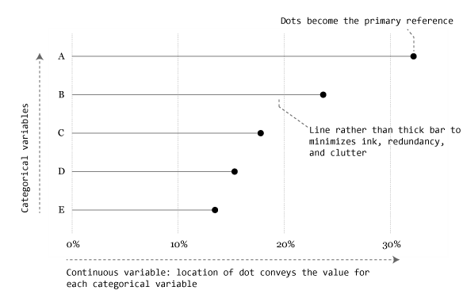

A hybrid between a [bar chart](http://uc-r.github.io/barcharts) and a [Cleveland dot plot](http://uc-r.github.io/cleveland-dot-plots) is the lollipop chart. A lollipop chart typically contains categorical variables on the y-axis measured against a second (continuous) variable on the x-axis.  Similar to the Cleveland dot plot, the emphasis is on the dot to draw the readers attention to the specific x-axis value achieved by each category. The line is meant to be a minimalistic approach to easily tie each category to its relative point without drawing too much attention to the line itself. A lollipop chart is great for comparing multiple categories as it aids the reader in aligning categories to points but minimizes the amount of ink on the graphic. 





## tl;dr
This tutorial introduces the basics of the lollipop chart and compares them to bar charts and dot plots. I also show how to go from a basic lollipop chart to a more refined, publication worthy graphic. If you're short on time jump to the sections of interest:

- [Replication requirements](#replication)
- [Basic dot plot](#basics)
- [Comparing multiple points of information](#groups)
- [Adding value markers](#markers)
- [Finishing touches](#finishing)

<br>

## Replication Requirements {#replication}
To reproduce the code throughout this tutorial you will need to load the following packages. The primary package of interest is [`ggplot2`](http://ggplot2.org/), which is a plotting system for R. You can build lollipop charts with base R graphics, but when I'm building more refined graphics I lean towards `ggplot2`. Note that I use the development version of ggplot2 which offers some nice title, subtitle, and caption options which I cover in the [last section](#finishing).  You can download the development version with this line of code: `devtools::install_github("hadley/ggplot2")`

```{r, echo=TRUE, message=FALSE, warning=FALSE, collapse=TRUE}
library(dplyr)          # for data manipulation
library(tidyr)
library(ggplot2)        # for generating the visualizations
```

```{r, echo=FALSE, message=FALSE, warning=FALSE, collapse=TRUE}
library(gridExtra)
```

In addition, throughout the tutorial I illustrate the graphics with the `midwest` data set provided in the `ggplot2` package.

```{r, collapse=TRUE}
head(midwest)
```


<a href="#top">Go to top</a>

<br>

## Basic Lollipop Chart {#basics}
Most readers would have little problem understanding either of the basic versions of the lollipop chart, dot plot or the bar chart. Consider if we want to view the top 25 counties in Ohio for percentage of college educated folks. After a little data manipulation (note that I order the counties by percent college educated (`percollege`) and then make the `county` variable a factor with the levels ordered accordingly; this will allow us to order the bars and dots in the following charts appropriately)...

```{r, echo=TRUE, collapse=TRUE, message=FALSE}
ohio_top25 <- midwest %>%
        filter(state == "OH") %>%
        select(county, percollege) %>%
        arrange(desc(percollege)) %>%
        top_n(25) %>%
        arrange(percollege) %>%
        mutate(county = factor(county, levels = .$county))
```

We could view the data as a horizontal bar chart...

```{r, fig.align='center'}
# bar chart
ggplot(ohio_top25, aes(county, percollege)) +
        geom_bar(stat = "identity") +
        coord_flip()
```

as a dot plot...
```{r, fig.align='center'}
# dot plot
ggplot(ohio_top25, aes(percollege, county)) +
        geom_point()
```

or as a lollipop chart. In the lollipop chart we use `geom_segment` to plot the lines and we explicitly state that we want the lines to start at `x = 0` and extend to the `percollege` value with `xend = percollege`.  We simply need to include `y = county` and `yend = county` to tell R the lines are horizontally attached to each county. 
```{r, fig.align='center'}
# lollipop chart
ggplot(ohio_top25, aes(percollege, county)) +
         geom_segment(aes(x = 0, y = county, xend = percollege, yend = county), color = "grey50") +
        geom_point()
```


<a href="#top">Go to top</a>

<br>

## Comparing Multiple Points of Information {#groups}
Consider the case where we want to compare counties in Ohio to see how they differ from the state average.  For this the emphasis becomes the state average so we can do a data manipulation to generate the state average value and test if each county above or below that value.

```{r, warning=FALSE, message=FALSE, fig.align='center', fig.height=11, collapse=TRUE}
ohio <- midwest %>%
        filter(state == "OH") %>%
        select(county, percollege) %>%
        arrange(percollege) %>%
        mutate(Avg = mean(percollege, na.rm = TRUE),
               Above = ifelse(percollege - Avg > 0, TRUE, FALSE),
               county = factor(county, levels = .$county))

head(ohio)
```
We can now incorporate this data into graphic by mapping the `x = ` argument within `geom_segment` to the state average and then color the counties based on if they are above or below average.

```{r, warning=FALSE, message=FALSE, fig.align='center', fig.height=11, collapse=TRUE}
ggplot(ohio, aes(percollege, county, color = Above)) +
        geom_segment(aes(x = Avg, y = county, xend = percollege, yend = county), color = "grey50") +
        geom_point()
```

Another comparison approach is if we wanted to compare the top 10 counties for each of the midwest states in our data set. In this case we have to do additional manipulation as each state has a couple county names that are common.


```{r, message=FALSE}
top10 <- midwest %>%
        select(state, county, percollege) %>%
        group_by(state) %>%
        arrange(desc(percollege)) %>%
        top_n(10) %>%
        arrange(percollege) %>%
        unite(county_st, county, state, remove = FALSE) %>%
        mutate(county_st = factor(county_st, levels = .$county_st))

head(top10)
```

We can now plot our data and facet by state to get small multiples representing the top 10 counties for each state. Here I abbreviate the names for brevity.

```{r, warning=FALSE, message=FALSE, fig.align='center', fig.height=5, collapse=TRUE}
ggplot(top10, aes(percollege, county_st)) +
         geom_segment(aes(x = 0, y = county_st, xend = percollege, yend = county_st), color = "grey50") +
        geom_point() +
        scale_y_discrete(labels = abbreviate) +
        facet_wrap(~ state, scales = "free_y")
```


<a href="#top">Go to top</a>

<br>

## Adding Value Markers {#markers}
Depending on the number of categories (i.e. counties) you are trying to graphically display, and the range of the x-axis, it can be helpful to add value markers to the points to clarify the difference between the points.

```{r, warning=FALSE, message=FALSE, fig.align='center', fig.height=5, collapse=TRUE}
OH_top10 <- midwest %>%
        select(state, county, percollege) %>%
        filter(state == "OH") %>%
        arrange(desc(percollege)) %>%
        top_n(10) %>%
        arrange(percollege) %>%
        mutate(county = factor(county, levels = .$county))

ggplot(OH_top10, aes(percollege, county, label = round(percollege, 1))) +
         geom_segment(aes(x = 0, y = county, xend = percollege, yend = county), color = "grey50") +
        geom_point() +
        geom_text(nudge_x = 1.5)
```

Alternatively you can enlarge the dots to include the labelling inside of them.

```{r, warning=FALSE, message=FALSE, fig.align='center', fig.height=5, collapse=TRUE}
ggplot(OH_top10, aes(percollege, county, label = paste0(round(percollege, 0), "%"))) +
         geom_segment(aes(x = 0, y = county, xend = percollege, yend = county), color = "grey50") +
        geom_point(size = 7) +
        geom_text(color = "white", size = 2)
```


<a href="#top">Go to top</a>

<br>

## Finishing Touches {#finishing}
Now let's take one of these outputs and create a nice, publication worthy graphic. 


<a href="#top">Go to top</a>

<br>

## Wrapping Up


<a href="#top">Go to top</a>

